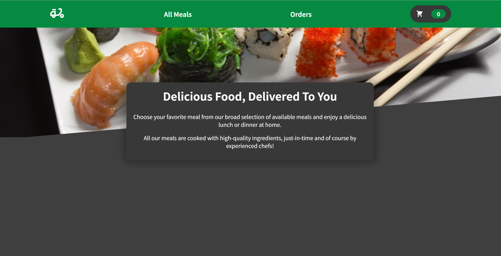
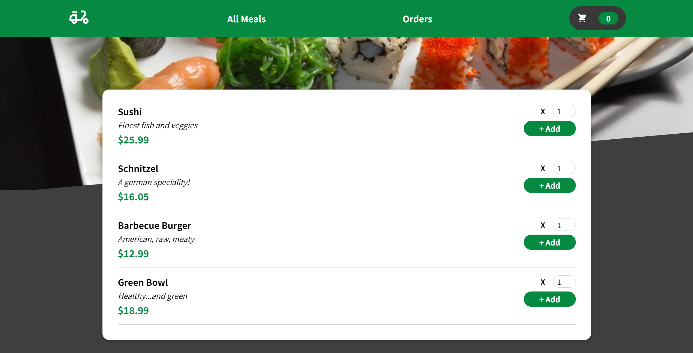
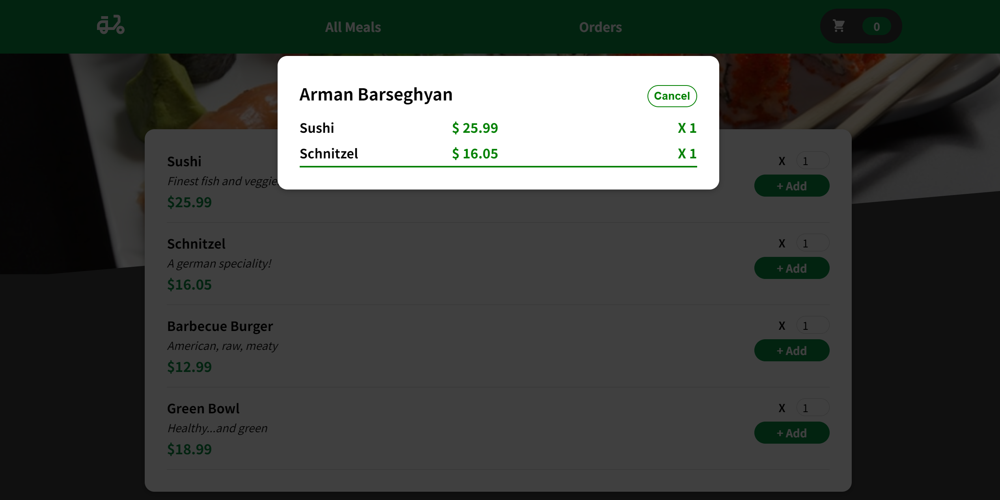
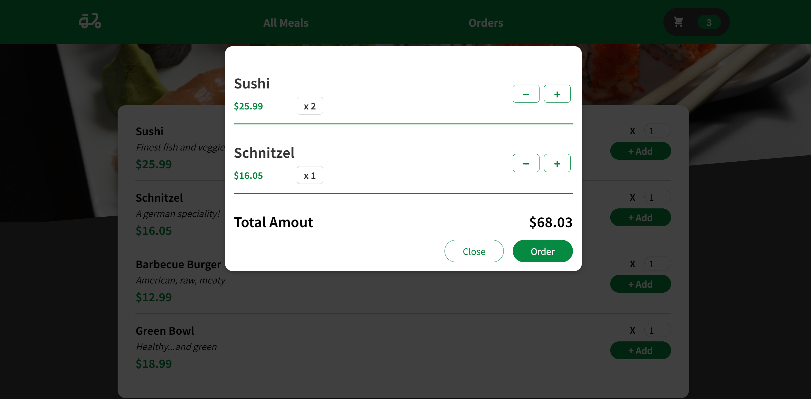

# Food Order

## Description
This is a food order website where the user can order meals, which is saved in the database. The user can increase, decrease or cancel the order, which will be saved in the database.

## Technologies Used
- HTML
- CSS
- JavaScript (ES6)
- React
- Context API
- Firebase db

## Usage
Use the navbar buttons to navigate between the pages. Add the meals to the cart in the 'All Meals" page using the '+Add' button. Change the qty of the meal using the '-' and '+' buttons in the cart. Fill the form and send the order. 

### Go to [Food Order](https://armanbarseghyan83.github.io/food-order/)

Home page

All meals

Orders

Shopping cart

## Questions
### Use the links below if you have any questions.
- Email Address - [armanbarseghyan83@gmail.com](mailto:armanbarseghyan83@gmail.com)
- Linkedin - [https://www.linkedin.com/in/arman-barseghyan](https://www.linkedin.com/in/arman-barseghyan)
- GitHub Profile - [https://github.com/ArmanBarseghyan83](https://github.com/ArmanBarseghyan83)